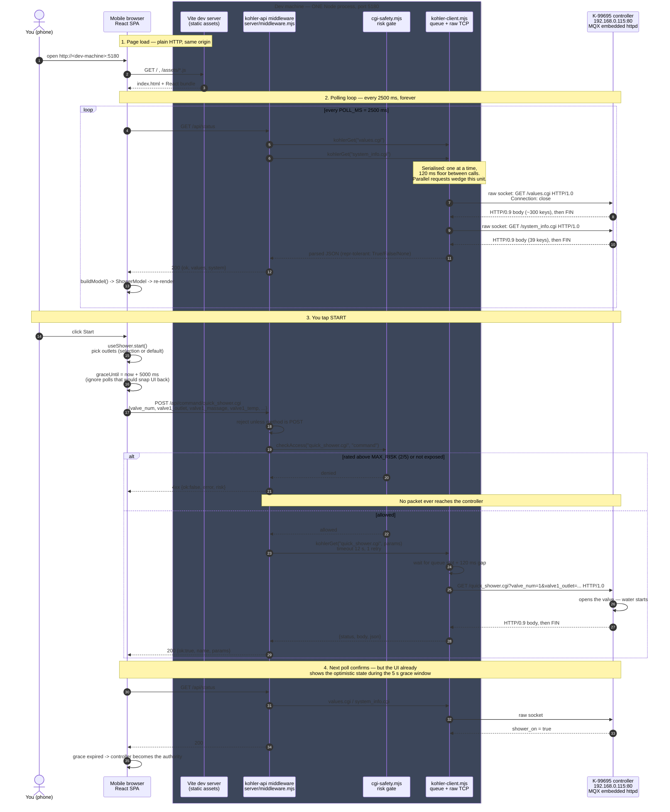

# Request flow

What actually happens between your phone and the controller when you tap
**Start** on the Shower screen. See [DESIGN.md](DESIGN.md) for why it is shaped
this way and [PROTOCOL.md](PROTOCOL.md) for the wire format.

## The one-line answer

The phone talks only to your dev machine on port 5180. The Vite dev server
serves the React app *and*, in the same Node process, hosts an `/api`
middleware that opens a raw TCP socket to the controller on port 80. There is
no separate proxy script and no Python anywhere — the middleware is a Vite
plugin (`vite.config.ts` -> `kohlerApi`) loaded into the dev server.

The browser cannot reach the controller directly: its `.cgi` handlers answer in
HTTP/0.9 (a bare body, no status line), which no browser, `fetch`, or WebView
HTTP stack will accept. Only a raw socket client can read it, so a Node process
stays in the picture on every platform.

## Sequence

## Who talks to whom

| Hop | Protocol | Who initiates |
| --- | --- | --- |
| phone -> dev machine :5180 | normal HTTP/1.1, JSON | browser `fetch` |
| dev machine -> controller :80 | HTTP/1.0 out, **HTTP/0.9 in**, raw `net.Socket` | Node |
| phone -> controller | **never happens** | — |

## Things worth knowing

- **Everything is one process.** `npm run dev` starts Vite; the plugin in
  [vite.config.ts](app/vite.config.ts) calls `createKohlerMiddleware()` and
  mounts it with `server.middlewares.use()`. Kill the terminal and both the web
  page and the proxy go away.
- **`server.host: true`** is what makes 5180 reachable from the phone at all —
  it binds every interface rather than just localhost.
- **`API_BASE` is empty in dev**, so the app calls `/api/...` on whatever origin
  served it. That is the seam for the Android/Capacitor port: a packaged app has
  no Node of its own and must be built with
  `VITE_API_BASE=http://<lan-host>:8080`.
- **`npm run serve`** ([server/standalone.mjs](app/server/standalone.mjs)) is
  the same middleware without Vite, serving `dist/` instead. Identical flow,
  different port.
- **Start and "change temperature" are the same call.** The controller takes the
  complete desired state every time, so `quick_shower.cgi` carries outlets,
  massage mode and temperature for both valves on every invocation.
- **Stop is a different endpoint.** Deselecting every outlet routes to
  `stop_shower.cgi`, not to `quick_shower.cgi` with an empty list.
