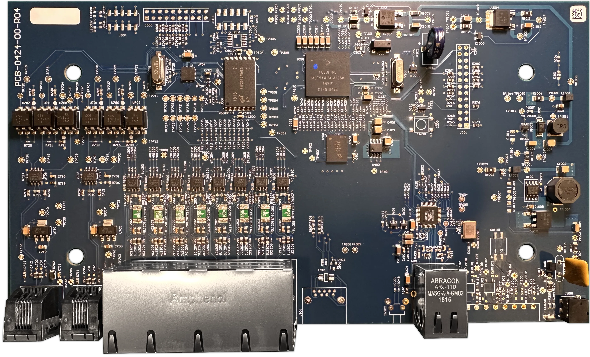

# Kohler DTV+

Analysis of the Kohler DTV+ system controller (K-99695-NA / K-99693-P-NA), and a
working replacement interface for it.

> ⚠️ **Read [DISCLAIMER.md](DISCLAIMER.md) before running anything here.** This
> drives water temperature and flow on undocumented, unauthenticated hardware.
> Water above **43 °C / 109 °F can scald**, and some controller endpoints can
> brick the unit. Not affiliated with, endorsed by, or supported by Kohler Co.

## Why

The K-99693 wall interface on this system failed. The controller still reports
every other component as healthy — valve, amplifier, controller all `conn` — and
simply has nothing left to command it:

```
num_interface        = 0
ui1_con_string       = not_seen      <- the failed touchscreen
valve_1_con_string   = conn
amp_con_string       = conn
controller_con_string = conn
```

The controller exposes an undocumented CGI API that its own web pages use. That
is the replacement input.

## What's here

| | |
| --- | --- |
| [app/](app/) | React + Vite interface styled after the K-99693. Runs on a dev machine, a LAN box, or a phone browser. |
| [PROTOCOL.md](PROTOCOL.md) | The controller's CGI API — transport quirks, endpoints, payload fields, safety ratings. |
| [DESIGN.md](DESIGN.md) | Architecture, decisions, testing, and what the Android/Capacitor port needs. |
| [DISCLAIMER.md](DISCLAIMER.md) | Safety warnings, CGI risk scale, and how this repo enforces it. |
| [AGENT.md](AGENT.md) / [CLAUDE.md](CLAUDE.md) | Contract for agents working here, including the story-log convention. |
| [STORY-LOG.md](STORY-LOG.md) | Significant events and reversals, newest first. |
| [research/SHUTOFF-INVESTIGATION.md](research/SHUTOFF-INVESTIGATION.md) | Open investigation into the shower stopping mid-use. |
| [research/SOURCES.md](research/SOURCES.md) | Monitoring index — where to sweep for new community findings. |
| [research/FIELD-NOTES.md](research/FIELD-NOTES.md) | What breaks when you automate a DTV+ — failure reports from the community, sourced, with what we changed in response. |
| [research/controller-mirror/](research/controller-mirror/) | Verbatim mirror of the controller's own web UI, plus live payload captures. |
| [research/xagon0/](research/xagon0/) | Vendored third-party analysis — see [PROVENANCE.md](research/xagon0/PROVENANCE.md). |
| [research/reference/](research/reference/) | Kohler's user guide, rendered for interface reference. |

## Quick start

```bash
cd app
npm install
npm run dev            # http://localhost:5180, and on your LAN IP
```

Set `KOHLER_HOST` if your controller is not at `192.168.0.115`.

```bash
npm test               # unit tests, no hardware
npm run selftest       # live checks, strictly read-only — never opens a valve
```

See [app/README.md](app/README.md) for hosting, the API surface, and the safety
gate.

## Safety gate

The controller has no authentication and exposes endpoints that can wipe or
brick it. Every known endpoint is rated 0-5 in
[app/server/cgi-safety.mjs](app/server/cgi-safety.mjs), and the proxy refuses
anything above **2/5** before a packet is sent. 18 endpoints are reachable out of
~50 known; `reset_factory.cgi`, `clear_dt.cgi`, `fileupload.cgi`,
`unpack_bin.cgi`, `edit_dt.cgi`, `rpc.cgi` and friends are permanently
unreachable.

## Hardware



The DTV+ system controller board — photograph by
[xagon0](https://github.com/xagon0/Kohler-DTV-Plus/blob/master/Images/Images.md),
re-encoded from the upstream 11 MB PNG to a 962 KB WebP at full 3710×2242
resolution (see [research/xagon0/PROVENANCE.md](research/xagon0/PROVENANCE.md)).
The controller
speaks RS-485 to the valve and amplifier, and HTTP/0.9-flavoured CGI to
everything else; [PROTOCOL.md](PROTOCOL.md) covers the latter.

## Credits

- [xagon0/Kohler-DTV-Plus](https://github.com/xagon0/Kohler-DTV-Plus) — CGI
  safety ratings, RS-485 protocol analysis, hardware and repair documentation.
- [dcmeglio/kohler-python](https://github.com/dcmeglio/kohler-python) — endpoint
  and parameter reference.
- Kohler's *User Guide — Digital Interface and System Controller for DTV+*
  (1241234-5-D) for the interface design.

Original CGI enumeration and controller notes from this repository's earlier
revisions are preserved in [PROTOCOL.md](PROTOCOL.md).
